# Звіт про виконання проекту: Реалізація VAE для набору даних CIFAR-10

## Опис набору даних
Для виконання проекту було використано набір даних **CIFAR-10**, який складається з 60,000 кольорових зображень розміром 32x32 пікселів, поділених на 10 класів. Кожен клас містить 6,000 зображень. Зображення включають об'єкти, такі як літаки, автомобілі, птахи тощо.

### Попередня обробка
- **Нормалізація**: Зображення було нормалізовано до діапазону [-1, 1], що сприяє стабільності навчання.
- **Розподіл даних**: Набір даних поділений на:
  - 50,000 зображень для навчання
  - 10,000 зображень для тестування.

Обробка виконувалась за допомогою бібліотеки PyTorch (`torchvision.transforms`).

## Структура проекту

### Файли та папки проекту:
- **`main.py`**: Основний вхідний файл, який запускає навчання.
- **`models.py`**: Містить архітектуру VAE: енкодер, декодер та обчислення латентного простору.
- **`train.py`**: Реалізація циклу навчання та функції візуалізації.
- **`dataset.py`**: Завантаження та підготовка набору даних CIFAR-10.
- **`utils.py`**: Допоміжні функції, такі як обчислення втрат та збереження графіків.
- **`output/`**: Папка для збереження результатів, включаючи графіки втрат та реконструкцій.
- **`models/`**: Папка для збереження зважень моделі.

---

## Опис експериментів

### Архітектура VAE
Модель включає:
1. **Енкодер**: Використовуються три згорткові шари, кожен з активацією ReLU.
2. **Латентний простір**: Два вектори для `mean` та `logvar`, що описують нормальний розподіл.
3. **Декодер**: Три транспоновані згорткові шари для відновлення зображень, активація ReLU, останній шар використовує `sigmoid`.

### Експерименти
Експерименти проводились з різними розмірами латентного простору:
- **Latent Dim = 16**
- **Latent Dim = 32**
- **Latent Dim = 64**
- **Latent Dim = 128**

Також тестувались різні коефіцієнти регуляризації KL-дивергенції (`beta`):
- **Beta = 0.5**
- **Beta = 1.0**
- **Beta = 2.0**

### Результати експериментів
#### Графіки втрат
Кожен експеримент містить графік втрат під час навчання:

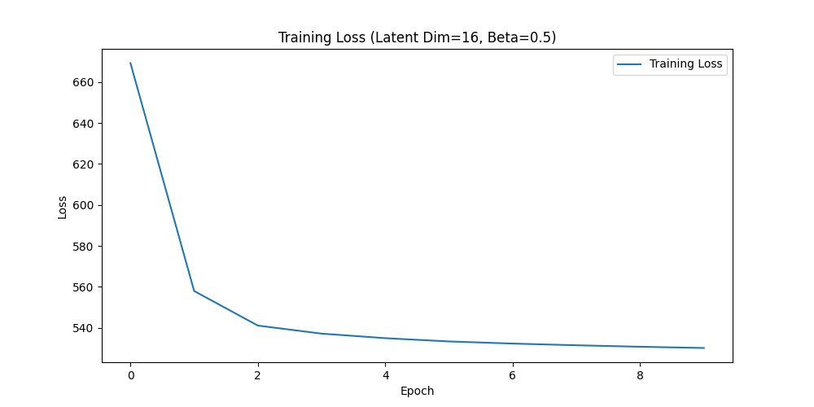
*Коментар*: На перших епохах втрата зменшується швидко, але досягає плато. Це свідчить про обмежений латентний простір, який не може відтворювати складні деталі.

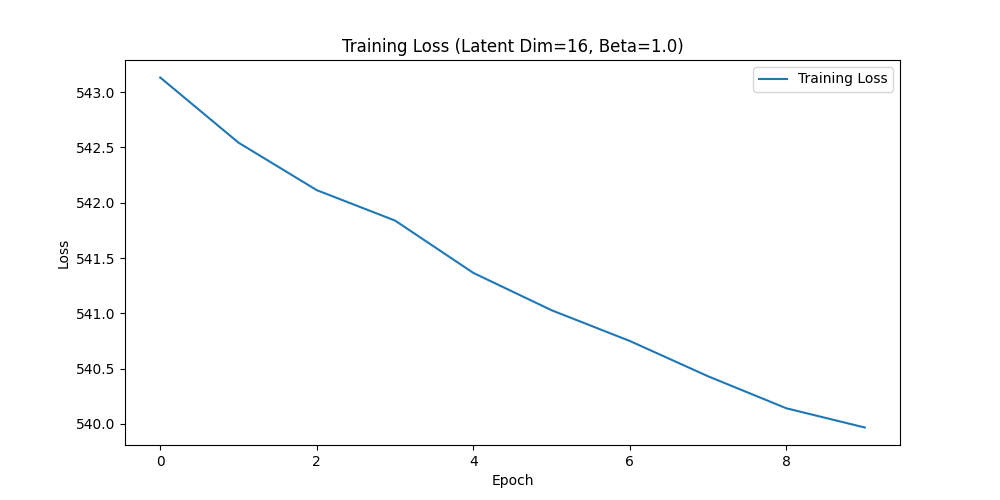
*Коментар*: При збільшенні `beta` модель краще регулює латентний простір, але втрати залишаються значними через недостатній розмір латентного простору.

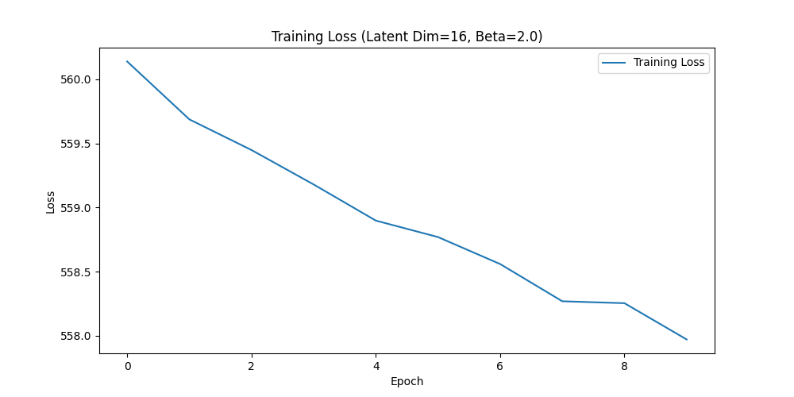
*Коментар*: Високе значення `beta` ще сильніше регулює латентний простір, але це впливає на якість реконструкції через високі втрати.

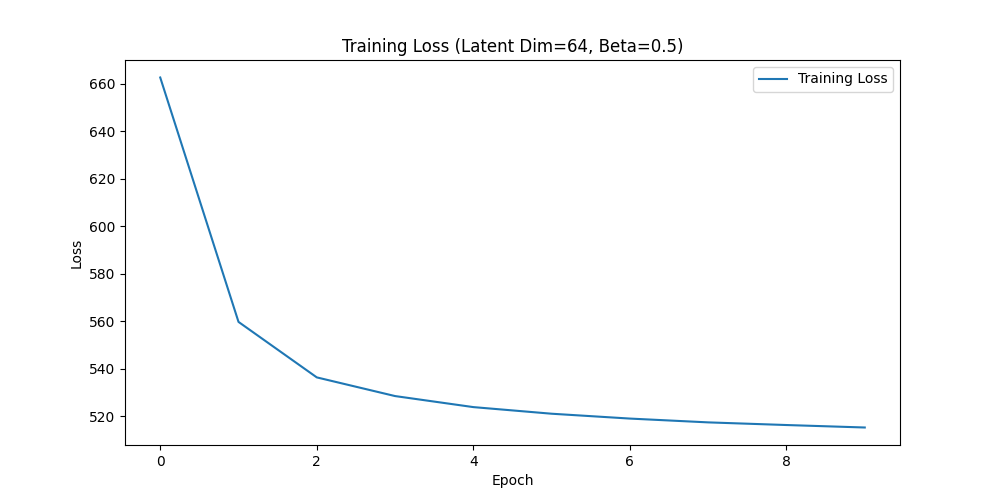
*Коментар*: Більший латентний простір дозволяє значно знизити втрати, особливо на пізніх епохах.

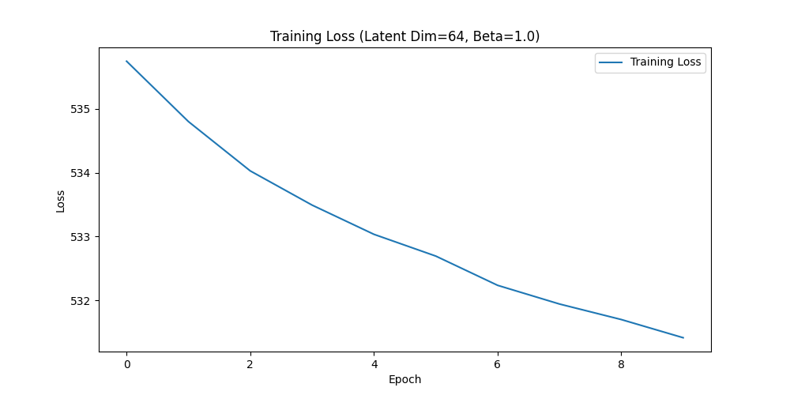
*Коментар*: Оптимальний баланс між регуляризацією та якістю реконструкції. Втрати зменшуються стабільно.

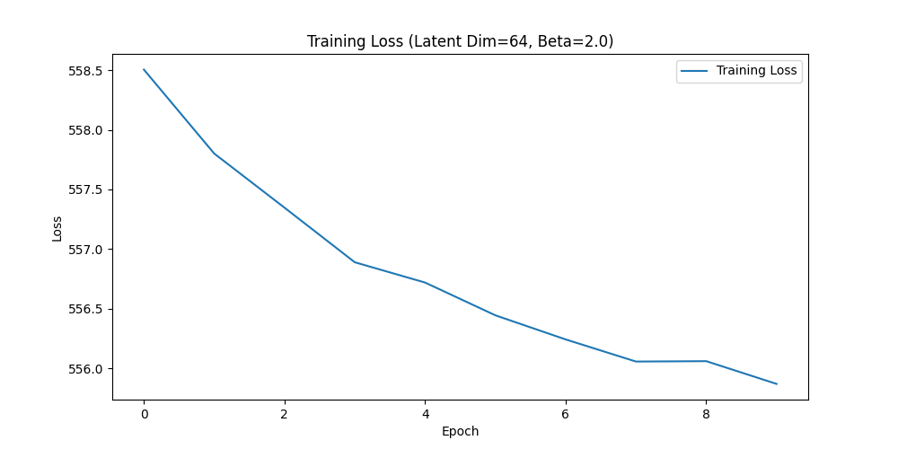
*Коментар*: Регуляризація стає занадто сильною, що впливає на стабільність втрат. Модель починає переобмежувати латентний простір.


#### Реконструкції
Для кожного експерименту представлені результати реконструкції зображень:

**Latent Dim = 16, Epoch 1:**

*Коментар*: На першій епосі модель лише починає навчання, і зображення важко розпізнати.

**Latent Dim = 16, Epoch 5:**

*Коментар*: Поліпшення видно, але якість все ще не задовільна через обмежений розмір латентного простору.

**Latent Dim = 16, Epoch 10:**

*Коментар*: Якість краща, але деталізація залишається низькою.

**Latent Dim = 32, Epoch 1:**
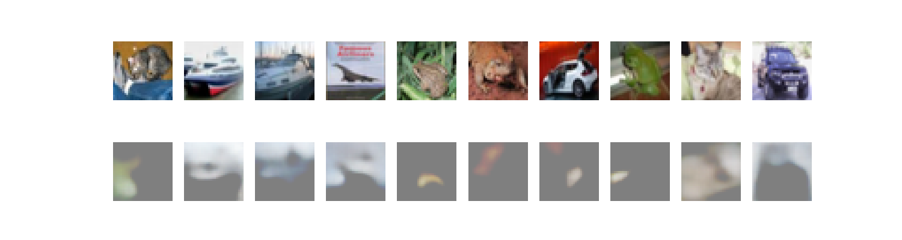
*Коментар*: Початкова якість схожа на Latent Dim = 16, але потенціал для поліпшення більший.

**Latent Dim = 32, Epoch 5:**
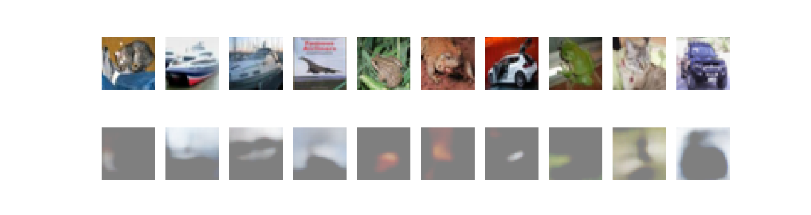
*Коментар*: Значне поліпшення деталізації.

**Latent Dim = 32, Epoch 10:**

*Коментар*: Реконструкція близька до оригіналу, але все ще трохи розмита.

**Latent Dim = 64, Epoch 1:**

*Коментар*: Початкова якість краща, ніж у менших латентних просторів.

**Latent Dim = 64, Epoch 5:**
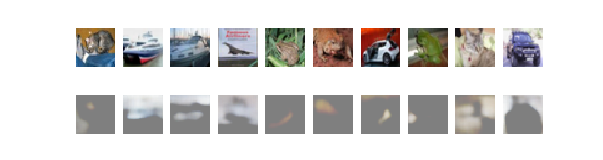
*Коментар*: Дуже добре видно покращення, деталі стають чіткими.

**Latent Dim = 64, Epoch 10:**
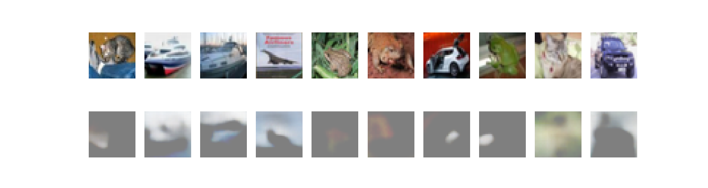
*Коментар*: Висока якість реконструкції, модель добре навчена.

**Latent Dim = 128, Epoch 1:**

*Коментар*: Початковий результат кращий через більший латентний простір.

**Latent Dim = 128, Epoch 5:**
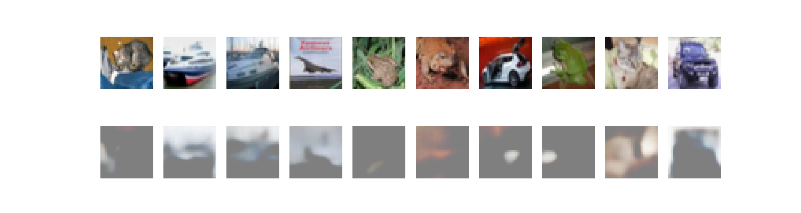
*Коментар*: Деталізація чітка, але є невеликі артефакти.

**Latent Dim = 128, Epoch 10:**
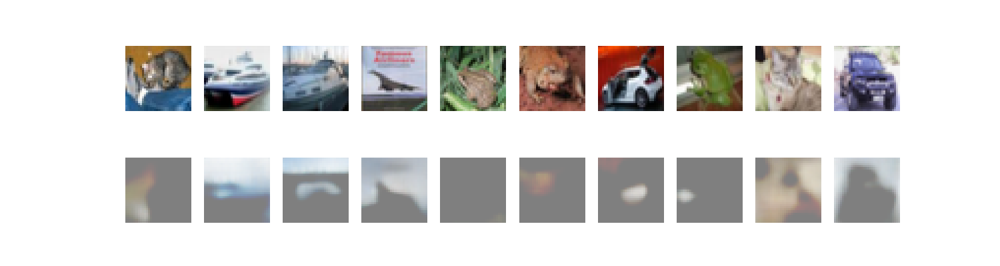
*Коментар*: Результат найкращий, модель відмінно відтворює деталі.

---

## Висновки
1. **Latent Dim = 16**:
   - Модель обмежена у відтворенні деталей через малий розмір латентного простору.
   - Підходить для зменшення розміру представлення, але не для генерації якісних зображень.

2. **Latent Dim = 64**:
   - Оптимальний баланс між складністю моделі та якістю реконструкції.
   - Відновлені зображення чіткі з великою кількістю деталей.

3. **Beta-регуляризація**:
   - Beta = 1.0 показала найкращий баланс між реконструкцією та регуляризацією латентного простору.

---

## Які можливі покращення
1. **Довше навчання**: Потрібно З=збільшити кількість епох для досягнення більш стабільного результату.
2. **Збільшення потужності**: Використання більшого GPU для експериментів з Latent Dim > 128.
3. **Енкодер та декодер**: Спробувати складніші архітектури (ResNet, DenseNet).
4. **Різні набори даних**: Тестувати модель на інших наборах даних (наприклад, CelebA).

Через брак обчислювальних потужностей ці покращення залишаються на майбутнє.

---

# Встановлення та запуск

## Створення та активація середовища

```
./setup_env.sh
source ./_env/bin/activate 
```

## 1. Встановлення необхідних бібліотек

```
pip install torch torchvision matplotlib numpy
```

## Запуск:
```
python main.py
```